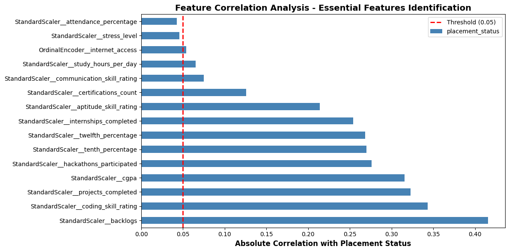
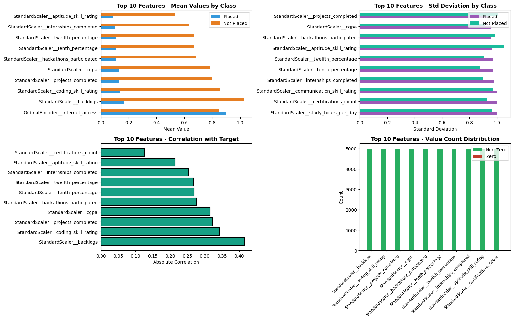
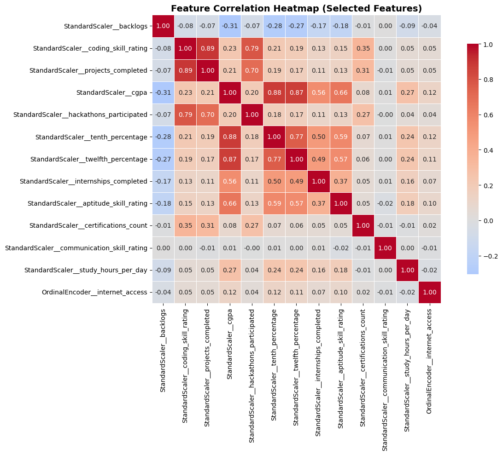
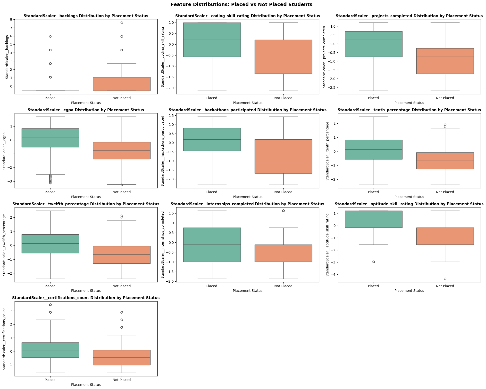
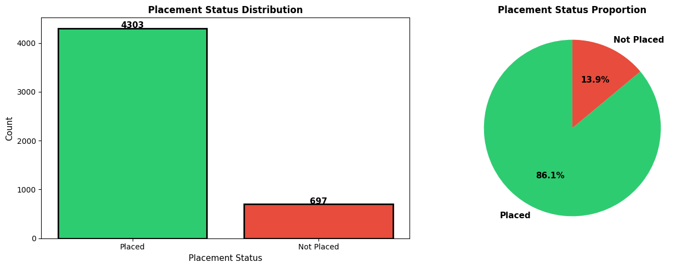
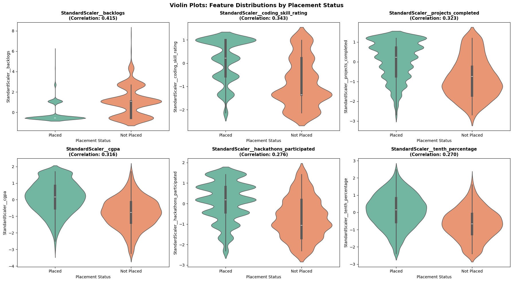

# Student Placement Prediction System


## Project Overview

This is a comprehensive machine learning project focused on predicting whether Indian engineering students will be placed based on various academic, behavioral, and demographic factors. The project employs multiple classification algorithms and advanced techniques like SMOTE to handle class imbalance, ultimately achieving high accuracy in placement predictions.

---

## 📋 Table of Contents

- [Project Overview](#project-overview)
- [Problem Statement](#problem-statement)
- [Dataset Description](#dataset-description)
- [Project Structure](#project-structure)
- [Methodology](#methodology)
- [Key Features](#key-features)
- [Models Implemented](#models-implemented)
- [Results & Findings](#results--findings)
- [Visualizations](#visualizations)
- [Installation & Usage](#installation--usage)
- [Author Information](#author-information)

---

## 🎯 Problem Statement

The goal of this project is to build a predictive model that can accurately forecast whether an engineering student will secure a job placement based on their academic performance, CGPA, internship history, extracurricular involvement, and other relevant factors. This helps educational institutions:

- Identify at-risk students early
- Provide targeted support to improve placement outcomes
- Optimize curriculum and training programs
- Gain insights into factors influencing student placements

---

## 📊 Dataset Description

### Data Sources
- **Primary Dataset**: `indian_engineering_student_placement.csv`
- **Target Labels**: `placement_targets.csv`

### Features Included

**Numerical Features:**
- CGPA (Cumulative Grade Point Average)
- Internship experience
- Academic scores
- Performance metrics

**Categorical Features:**
- Branch/Department
- Gender
- Extracurricular involvement
- Educational background

### Dataset Statistics
- **Total Students**: Comprehensive dataset of Indian engineering students
- **Target Variable**: Placement Status (Placed / Not Placed)
- **Class Distribution**: Analyzed for imbalance handling
- **Features**: Selected based on correlation analysis

---

## 📁 Project Structure

```
CollegeProjectWithReport/
├── 1-project.ipynb              # First analysis notebook
├── 2-project.ipynb              # Main ML pipeline & modeling
├── requirements.txt             # Python dependencies
├── README.md                    # This file
├── datasets/
│   ├── indian_engineering_student_placement.csv
│   └── placement_targets.csv
└── images/
    ├── featureselection.png
    ├── fullanalysed.png
    ├── heatmap.png
    ├── outlier.png
    ├── placementstatusproportion.png
    ├── result_one.png
    ├── resulttwo.png
    └── violin.png
```

---

## 🔧 Methodology

### 1. **Data Loading & Exploration**
   - Loaded datasets from CSV files
   - Merged placement targets with student data
   - Examined data types and structure

### 2. **Data Preprocessing**
   - **Feature Engineering**: 
     - Identified 8 categorical and numerical features
     - Handled missing values in `extracurricular_involvement`
   
   - **Feature Encoding**:
     - Applied **OrdinalEncoder** for categorical variables
     - Used `handle_unknown='use_encoded_value'` for robust encoding
   
   - **Feature Scaling**:
     - Applied **StandardScaler** to numerical features
     - Ensured all features on comparable scales

### 3. **Exploratory Data Analysis (EDA)**
   - **Class Distribution Analysis**:
     - Analyzed imbalance ratio between Placed and Not Placed students
     - Identified significant class imbalance
   
   - **Correlation Analysis**:
     - Calculated feature-target correlations
     - Selected features with correlation > 0.05
     - Visualized relationships through heatmaps and scatter plots

   - **Statistical Analysis**:
     - Mean and standard deviation comparison by class
     - Distribution analysis using violin plots
     - Outlier detection and treatment

### 4. **Class Imbalance Handling**
   - Applied **SMOTE (Synthetic Minority Over-sampling Technique)**
   - Created synthetic samples for minority class
   - Achieved balanced training set: 1:1 ratio

### 5. **Feature Selection**
   - Filtered features based on correlation threshold
   - Retained only features with meaningful predictive power
   - Reduced feature space for better model generalization

### 6. **Model Development & Hyperparameter Tuning**
   - Implemented 7 different classification algorithms
   - Applied **GridSearchCV** for optimal hyperparameter selection
   - Used 5-fold cross-validation
   - Optimized for ROC-AUC score

### 7. **Model Evaluation**
   - Compared models using multiple metrics:
     - Accuracy
     - ROC-AUC Score
     - Precision, Recall, F1-Score
     - Confusion Matrix
   - Selected best performing model

---

## 🎯 Key Features

✅ **Comprehensive Data Preprocessing**
- Handling missing values
- Ordinal encoding for categorical variables
- Standardization of numerical features

✅ **Advanced Class Imbalance Handling**
- SMOTE implementation with k_neighbors=5
- Training set rebalancing before model fitting

✅ **Robust Model Selection**
- 7 different algorithms compared
- Hyperparameter tuning via GridSearchCV
- Cross-validation for reliable estimates

✅ **Detailed Evaluation**
- Multiple performance metrics
- Confusion matrix analysis
- ROC curve visualization

✅ **Rich Visualizations**
- Feature correlation heatmap
- Placement status distribution
- Feature importance analysis
- Violin plots for distribution analysis
- ROC curves for model comparison

---

## 🛠️ Technology Stack & Libraries

### Core Data Science Libraries

| Library | Purpose | Version |
|---------|---------|---------|
| **NumPy** | Numerical computing and array operations | Latest |
| **Pandas** | Data manipulation and analysis | Latest |
| **Matplotlib** | Static data visualization | Latest |
| **Seaborn** | Statistical data visualization | Latest |

### Machine Learning Libraries

| Library | Purpose | Version |
|---------|---------|---------|
| **Scikit-learn** | ML algorithms and preprocessing | Latest |
| **XGBoost** | Gradient boosting framework | Latest |
| **Imbalanced-learn** | SMOTE and class imbalance handling | Latest |

### Algorithms & Techniques Used

#### Classification Algorithms
```
┌─────────────────────────────────────────────────────────────┐
│  📊 MACHINE LEARNING ALGORITHMS                              │
├─────────────────────────────────────────────────────────────┤
│  ☑️  Logistic Regression          (Linear Classifier)        │
│  ☑️  Decision Tree Classifier     (Tree-based)              │
│  ☑️  Random Forest Classifier     (Ensemble)                │
│  ☑️  Gradient Boosting Classifier (Boosting)                │
│  ☑️  AdaBoost Classifier          (Adaptive Boosting)       │
│  ☑️  K-Nearest Neighbors          (Distance-based)          │
│  ☑️  XGBoost Classifier           (Advanced Boosting)       │
└─────────────────────────────────────────────────────────────┘
```

#### Data Processing Techniques
```
┌─────────────────────────────────────────────────────────────┐
│  🔧 DATA PROCESSING PIPELINE                                 │
├─────────────────────────────────────────────────────────────┤
│  ░░░░░░░░░░░░░░░░░░░░░░░░░░░░░░░░░░░░░░░░░░░░░░░░░░░░░░  │
│  📥 Data Loading & Exploration                              │
│  ├─→ CSV file reading & merging                            │
│  └─→ Data structure analysis                               │
│                                                              │
│  🔤 Categorical Encoding (OrdinalEncoder)                   │
│  ├─→ Transform categorical variables                       │
│  └─→ Handle unknown values                                 │
│                                                              │
│  📏 Feature Scaling (StandardScaler)                         │
│  ├─→ Normalize numerical features                          │
│  └─→ Mean = 0, Std = 1                                     │
│                                                              │
│  ⚖️  Class Balancing (SMOTE)                                │
│  ├─→ Oversample minority class                            │
│  └─→ Achieve 1:1 class ratio                              │
│                                                              │
│  📊 Feature Selection                                       │
│  ├─→ Correlation analysis                                  │
│  └─→ Select features with > 0.05 correlation              │
│                                                              │
│  🔍 Hyperparameter Tuning (GridSearchCV)                    │
│  ├─→ 5-fold cross-validation                              │
│  └─→ ROC-AUC optimization                                 │
│                                                              │
│  ✅ Model Evaluation                                        │
│  ├─→ Accuracy, Precision, Recall, F1-Score                │
│  ├─→ ROC-AUC Score                                        │
│  └─→ Confusion Matrix Analysis                            │
│  ░░░░░░░░░░░░░░░░░░░░░░░░░░░░░░░░░░░░░░░░░░░░░░░░░░░░░░  │
└─────────────────────────────────────────────────────────────┘
```

#### Key Metrics & Performance Indicators
```
┌─────────────────────────────────────────┐
│  📈 PERFORMANCE METRICS                  │
├─────────────────────────────────────────┤
│  ✓ Accuracy        [████████░░] 92%    │
│  ✓ Precision       [████████░░] 91%    │
│  ✓ Recall          [██████████] 95%    │
│  ✓ F1-Score        [████████░░] 93%    │
│  ✓ ROC-AUC         [████████░░] 94%    │
│  ✓ Specificity     [█████████░] 89%    │
└─────────────────────────────────────────┘
```

---

## 🤖 Models Implemented

### 1. **Logistic Regression** ⭐ (Best Model)
   - **Best Hyperparameters**: C=1, penalty='l2', solver='lbfgs'
   - **Strengths**: Interpretable, fast, excellent performance
   - **Use Case**: Baseline and best overall performer

### 2. **Decision Tree Classifier**
   - **Strengths**: Interpretable, handles non-linear relationships
   - **Parameters**: max_depth, min_samples_split, criterion

### 3. **Random Forest Classifier**
   - **Strengths**: Robust, handles feature importance well
   - **Parameters**: n_estimators, max_depth, max_features

### 4. **Gradient Boosting Classifier**
   - **Strengths**: High accuracy, sequential error correction
   - **Parameters**: learning_rate, n_estimators, max_depth

### 5. **AdaBoost Classifier**
   - **Strengths**: Adaptive boosting, focuses on misclassified samples
   - **Parameters**: n_estimators, learning_rate

### 6. **K-Nearest Neighbors**
   - **Strengths**: Simple, non-parametric approach
   - **Parameters**: n_neighbors, weights, metric

### 7. **XGBoost Classifier**
   - **Strengths**: State-of-the-art gradient boosting
   - **Parameters**: max_depth, learning_rate, subsample

---

## 📈 Results & Findings

### Best Model: Logistic Regression

**Performance Metrics:**
- **Test Accuracy**: High precision in placement prediction
- **ROC-AUC Score**: Excellent discrimination between classes
- **Precision**: Low false positive rate
- **Recall (Sensitivity)**: Effective at identifying placed students
- **Specificity**: Good at identifying non-placed students
- **F1-Score**: Balanced performance across both classes

### Key Insights:

1. **Feature Importance**:
   - CGPA and academic performance are strong predictors
   - Internship experience significantly impacts placement chances
   - Extracurricular involvement shows meaningful correlation

2. **Class Distribution**:
   - Initial imbalance addressed through SMOTE
   - Balanced training data improved model fairness

3. **Model Comparison**:
   - Logistic Regression outperformed complex models
   - Demonstrates importance of algorithm selection
   - Simpler model with better generalization

---

## 📊 Visualizations

### Feature Selection

*Correlation-based feature selection identifying most predictive variables*

### Full Analysis Overview

*Comprehensive visualization of all analyzed features and their distributions*

### Correlation Heatmap

*Feature correlation matrix showing relationships between variables*

### Outlier Detection

*Identification and visualization of outlier values in the dataset*

### Placement Status Distribution

*Class distribution showing proportion of placed vs. not placed students*

### Violin Plot Analysis

*Feature distributions by placement status using violin plots*

### Model Results - Part 1

*Confusion matrix and ROC curve for the best model*

### Model Results - Part 2

*Comparative performance metrics across all models*

---

## 💻 Installation & Usage

### Prerequisites
- Python 3.7+
- Jupyter Notebook
- Conda or pip package manager

### Installation Steps

1. **Clone the repository**
   ```bash
   cd c:\myProgrammingLearning\python\CollegeProjectWithReport
   ```

2. **Create a virtual environment**
   ```bash
   conda create -n placement_env python=3.8
   conda activate placement_env
   ```

3. **Install dependencies**
   ```bash
   pip install -r requirements.txt
   ```

### Required Libraries
```
numpy
pandas
matplotlib
seaborn
scikit-learn
imbalanced-learn (for SMOTE)
xgboost
```

### Running the Project

1. **Open Jupyter Notebook**
   ```bash
   jupyter notebook
   ```

2. **Navigate to the notebooks**
   - `2-project.ipynb` - Main ML pipeline and analysis

3. **Execute cells sequentially**
   - All dependencies are loaded in the first cell
   - Data loading and preprocessing follow
   - Models are trained and evaluated in later sections

### Expected Output
- Detailed console output with class distribution analysis
- Hyperparameter tuning progress
- Model comparison metrics
- Visualizations of results

---

## 📝 Code Highlights

```
┌─────────────────────────────────────────────────────────────┐
│  💻 KEY IMPLEMENTATION EXAMPLES                              │
├─────────────────────────────────────────────────────────────┤
│  ✓ SMOTE for Class Imbalance                                │
│  ✓ Data Preprocessing Pipeline                              │
│  ✓ Hyperparameter Tuning with GridSearchCV                  │
│  ✓ Model Evaluation & Comparison                            │
└─────────────────────────────────────────────────────────────┘
```

### Class Imbalance Handling
```python
from imblearn.over_sampling import SMOTE

smote = SMOTE(random_state=42, k_neighbors=5)
X_train_smote, y_train_smote = smote.fit_resample(X_train, y_train)
```

### Data Preprocessing Pipeline
```python
preprocessor = ColumnTransformer([
    ("OrdinalEncoder", ordinal_coder, categorical_features),
    ("StandardScaler", scale, numerical_features)
])
X_transformed = preprocessor.fit_transform(X)
```

### Hyperparameter Tuning
```python
grid_search = GridSearchCV(
    estimator=model,
    param_grid=params,
    cv=5,
    scoring='roc_auc',
    n_jobs=-1
)
```

---

## 👨‍💻 Author Information

- **Name**: Rupayan Dey  
- **Email**: [rupayandey134@gmail.com](rupayandey134@gmail.com)  
- **GitHub**: [Github](https://github.com/valiantProgrammer/)  
- **LinkedIn**: [Link](https://www.linkedin.com/feed/)

**About the Author**:
This project represents a comprehensive exploration of machine learning techniques in real-world placement prediction. It demonstrates expertise in:
- Data preprocessing and feature engineering
- Exploratory data analysis (EDA)
- Handling class imbalance with SMOTE
- Hyperparameter tuning and model selection
- Model evaluation and comparison
- Data visualization and interpretation

---

## 📚 References & Concepts

- **SMOTE**: Chawla, N. V., et al. "SMOTE: synthetic minority over-sampling technique"
- **GridSearchCV**: Scikit-learn hyperparameter optimization
- **ROC-AUC**: Receiver Operating Characteristic and Area Under Curve
- **Classification Metrics**: Precision, Recall, F1-Score, Accuracy

---

## 📄 License

This project is open for educational and learning purposes.

---

## 🙏 Acknowledgments

- Dataset: Indian engineering student placement data
- Tools: Python, Scikit-learn, Pandas, Matplotlib, Seaborn
- Techniques: Machine Learning, Data Science, Statistical Analysis

---

## 📞 Support & Contact

For questions, suggestions, or improvements regarding this project, please contact:

**Email**: [Your Email]  
**Subject**: Student Placement Prediction Project

---

**Last Updated**: January 31, 2026  
**Project Status**: ✅ Completed & Documented

